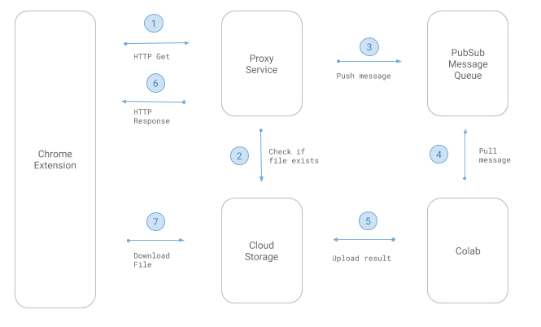

A chrome extension that adds depth parallax (an effect similar to Facebook 3D photos)
on images from instagram profile pages.

It uses [3d-photo-inpainting](https://github.com/vt-vl-lab/3d-photo-inpainting)
running in Colab (free GPU) and Cloud pubsub/storage for communication.

More info: https://twitter.com/cyrildiagne/status/1251920177782042624


**Original Paper:** [3D Photography using Context-aware Layered Depth Inpainting](https://arxiv.org/abs/2004.04727)
_Meng-Li Shih, Shih-Yang Su, Johannes Kopf, Jia-Bin Huang_

### ⚠️ Word of caution!

🧪 This project is highly experimental and requires a strong knowledge of the Google Cloud Platform to setup & run.

# Architecture



This extension works by communicating with a Colab notebook running as GPU worker to compute the 3D inpainting videos.

For this extension to work, there are 2 other applications that must be running:

1. [The Colab notebook](https://github.com/cyrildiagne/instagram-3d-photo/blob/master/colab_worker.ipynb). It must be openned in another tab with the last cell running.
2. [The proxy service](https://github.com/cyrildiagne/instagram-3d-photo/tree/master/backend). It must be running (either remotely or on your computer) to receive HTTP requests from the extension and turn them into PubSub messages that the Colab listens to.

# Setup the GCP Project

### Create a GCP project

First create a project on the [Google Cloud Platform](https://console.cloud.google.com/).
Then install the [Cloud SDK](https://cloud.google.com/sdk/docs/quickstarts) and initialize it in your local machine with `gcloud init`.

Alternatively, you can also use Cloud Shell.

In a terminal window, set the local default project:

```bash
export PROJECT_ID=<your gcp project id>
gcloud config set project $PROJECT_ID
```

### Create a service account for colab to be able to access cloud pubsub & storage.

It will create a `insta3d-colab-key.json` file that you must upload on the Colab to authenticate the notebook with your project.

```bash
export COLAB_SA=insta3d-colab
export COLAB_KEY_FILE=./insta3d-colab-key.json
./scripts/create_colab_key.sh
```

### Create the Pubsub topic and subscription

```bash
export TOPIC_NAME=insta3d
./scripts/create_colab_key.sh
```

### Enable CORS on your bucket

For the extension to be able to load the images generated by the colab, the CORS must be enabled on a Cloud Storage Bucket.

One way to do so is to create a file `cors.json`

```json
[
  {
    "origin": ["*"],
    "responseHeader": ["Content-Type"],
    "method": ["GET"],
    "maxAgeSeconds": 3600
  }
]
```

And apply it to your bucket by running:

```bash
export BUCKET_NAME=<your-bucket-name>
gsutil cors set cors.json gs://$BUCKET_NAME
```

/!\ This will enable the CORS on the entire bucket.

# Run the proxy service locally

(Recommended) Create a virtual environment

```bash
virtualenv venv
source venv/bin/activate
```

Install the dependencies:

```bash
pip install -r proxy/requirements.txt
```

Start the proxy:

```
export GOOGLE_APPLICATION_CREDENTIALS=$(pwd)/insta3d-colab-key.json
python proxy/main.py
```

# Run the Colab

Open the [notebook](https://github.com/cyrildiagne/instagram-3d-photo/blob/master/colab_worker.ipynb) in Colab and follow the instructions.
Make sure you've activated a GPU Runtime.

# Load the extension & enjoy

Phew, when all that is done, it's time to load the extension and profit!

- Navigate to [chrome://extensions](chrome://extensions)
- Click the `Load unpacked` button
- Select the "extension" folder from this repo.

It should add a new icon in your extensions bar that you can use to trigger the extension.
Keep an eye on the console to check for eventual errors.

# Changes with the original 3d-photo-inpainting

- Update `argument.yml` to use custom path + smaller size + custom fps/duration
- Update straight-line and circle paths in `utils.py`
- Set ffmpeg to create 1 keyframe per frame in `mesh.py`

# Thanks and acknowledgements

[3d-photo-inpainting](https://github.com/vt-vl-lab/3d-photo-inpainting) The original paper, code and notebook.

[@derek-xia](https://github.com/derek-xia) for the help improving the documentation.